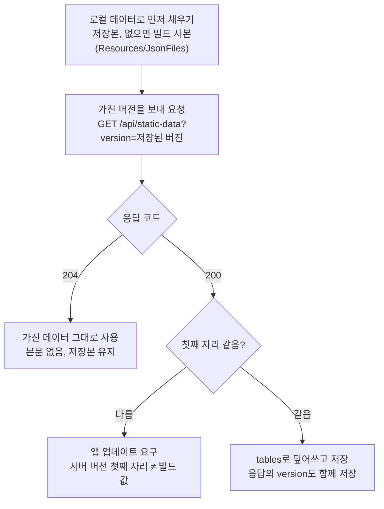

# 정적 데이터 API 사용 가이드

서버가 가진 기획 데이터를 클라이언트에 내려주고, 서버 코드에서 조회하는 방법을 정리한다. 기준은 `DesignDecisions.md` 2번이다.

## 1. 개요
`GET /api/static-data`는 서버가 가진 기획 데이터 8개 테이블을 버전 문자열과 함께 내려주는 API다. 로그인 전에 호출하므로 인증 없이 열려 있다.

- 원천: 구글 시트에서 만든 JSON 파일. 서버 레포 `src/main/resources/data/`에 두고 jar에 포함한다.
- 서버: 시작할 때 JSON을 읽고 검증해 메모리에 둔다(`StaticDataService`). 검증에 실패하면 서버가 뜨지 않는다.
- 클라이언트: 가진 데이터 버전을 보내고, 버전이 다를 때만 새 데이터를 받는다. 같으면 본문 없는 204를 받는다.
- 효과: 값 수정과 행 추가는 서버 재배포만으로 클라이언트에 반영된다. 클라이언트 코드가 바뀌어야 하는 변경은 앱 업데이트가 필요하다.

## 2. 엔드포인트
엔드포인트는 하나다. 쿼리의 `version`이 서버 버전과 같으면 204, 다르거나 없으면 200과 전체 데이터를 돌려준다.

| 항목 | 값 |
|---|---|
| 메서드 · 경로 | `GET /api/static-data` |
| 인증 | 없음 (`SecurityConfig`에서 `permitAll`) |
| 쿼리 파라미터 | `version` (선택): 클라이언트가 가진 데이터 버전. 예: `1.0.0` |
| 서버 버전 위치 | `src/main/resources/data/version.txt` |

| 조건 | 상태 코드 | 본문 |
|---|---|---|
| `version`이 서버 버전과 같음 | 204 No Content | 없음 |
| `version`이 다르거나 없음 | 200 OK | `version`, `tables` |

200 본문의 필드:
- `version`: 서버 데이터 버전 문자열. 클라이언트는 다음 호출에 이 값을 보낸다.
- `tables`: 테이블 이름 → 원본 JSON. 각 테이블은 `{ "datas": [행, ...] }` 형태다. 서버가 쓰지 않는 클라이언트 전용 열(stageName, iconPath 등)도 그대로 들어 있다.

`tables`에 들어가는 테이블은 아래 8개다. "서버가 읽는 열"이 빠지면 서버가 시작하지 못한다.

| 테이블 | 서버 record | 서버가 읽는 열 |
|---|---|---|
| AccountConst | `AccountConstData` (행 1개) | initialGold, initialGem, initialStamina, maxStamina, accountBaseRequiredExp, accountRequiredExpIncrement, maxAccountLevel, battleStaminaCost, staminaRecoverySeconds, accountExpPerKill, accountExpPerSecond, luckTrainGoldMax |
| Stage | `StageData` | stageId, stageDuration, waveId, clearAccountExp, rewardBoxGradeWeights |
| Wave | `WaveEntryData` | waveEntryId, waveId, patternStartTime, patternId, monsterId |
| SpawnPattern | `SpawnPatternData` | patternId, eventType, spawnCount, spawnInterval, patternDuration, dropTableId |
| Monster | `MonsterData` | monsterId, monsterType |
| DropTable | `DropTableEntryData` | dropTableId, dropGroup, dropItemType, weight, count |
| DropItem | `DropItemData` | dropItemId, dropItemType, value |
| Item | `ItemData` | itemId, slotType, grade |

## 3. 요청·응답 예시
로컬 서버(기본 포트 8080) 기준이다. 서버 버전은 현재 `1.0.0`이다.

```bash
# 처음 받을 때(버전 없음) → 200 + 전체 데이터
curl -i "http://localhost:8080/api/static-data"

# 가진 버전이 서버와 다름 → 200 + 전체 데이터
curl -i "http://localhost:8080/api/static-data?version=0.9.0"

# 가진 버전이 서버와 같음 → 204, 본문 없음
curl -i "http://localhost:8080/api/static-data?version=1.0.0"
```

200 응답(일부 생략):

```json
{
  "version": "1.0.0",
  "tables": {
    "AccountConst": {
      "datas": [
        {
          "initialGold": 0,
          "initialGem": 0,
          "initialStamina": 60,
          "maxStamina": 60,
          "accountBaseRequiredExp": 100,
          "accountRequiredExpIncrement": 100,
          "maxAccountLevel": 20,
          "battleStaminaCost": 5
        }
      ]
    },
    "Stage": {
      "datas": [
        {
          "stageId": 1,
          "stageName": "Forest",
          "stageIllustrationColor": "#4C7A3D",
          "stageDuration": 150.0,
          "waveId": 1,
          "stageDescription": "몬스터가 가득한 숲입니다.",
          "clearAccountExp": 500,
          "rewardBoxGradeWeights": [100, 0, 0]
        }
      ]
    },
    "Wave": { "datas": [ ... ] },
    "SpawnPattern": { "datas": [ ... ] },
    "Monster": { "datas": [ ... ] },
    "DropTable": { "datas": [ ... ] },
    "DropItem": { "datas": [ ... ] },
    "Item": { "datas": [ ... ] }
  }
}
```

`tables.<이름>`의 값은 `data/<이름>.json` 파일 내용과 같다. 클라이언트는 이 값을 기존 `Resources/JsonFiles`의 파일처럼 그대로 파싱하면 된다.

## 4. 클라이언트에서 쓰기
클라이언트는 로컬 데이터로 먼저 시작하고, 로그인 전에 이 API를 한 번 호출해 버전이 다를 때만 덮어쓴다.



204면 그대로 진행하고, 200이면 첫째 자리를 확인한 뒤 덮어쓰거나 앱 업데이트를 요구한다.

- 저장된 버전이 없으면 `version` 없이 호출한다. 서버는 항상 200을 돌려준다.
- 클라이언트 빌드는 자신이 읽을 수 있는 첫째 자리 값을 가진다. 현재 데이터 기준으로 `1`이다.
- `tables`의 각 값은 기존 `Resources/JsonFiles/<이름>.json`과 같은 형식이라 기존 파서를 그대로 쓸 수 있다.
- 클라이언트 `JsonDataManager`는 지금 `Awake`에서 `Resources`를 동기로 읽는다. 이 흐름으로 바꾸는 작업이 필요하다(`DesignDecisions.md` 2번 구현 기준).

## 5. 서버에서 쓰기
서버 코드는 `StaticDataService`를 주입받아 getter로 조회한다. 데이터를 바꾸려면 `data/`의 JSON과 `version.txt`를 함께 바꾸고 재배포한다.

### 5.1 코드에서 조회하기
| getter | 반환 타입 | 키 |
|---|---|---|
| `getAccountConst()` | `AccountConstData` | 없음(단일 행) |
| `getStages()` | `Map<Integer, StageData>` | stageId |
| `getWaves()` | `Map<Integer, List<WaveEntryData>>` | waveId |
| `getSpawnPatterns()` | `Map<Integer, SpawnPatternData>` | patternId |
| `getMonsters()` | `Map<Integer, MonsterData>` | monsterId |
| `getDropTables()` | `Map<Integer, List<DropTableEntryData>>` | dropTableId |
| `getDropItems()` | `Map<DropItemType, DropItemData>` | dropItemType |
| `getItems()` | `Map<Long, ItemData>` | itemId |
| `getVersion()` | `String` | 없음 |
| `getTables()` | `Map<String, JsonNode>` | 테이블 이름(클라이언트 전송용 원본) |

모든 맵과 리스트는 수정 불가다. 사용 예시(가상의 서비스):

```java
@Service
@RequiredArgsConstructor
public class BattleService {
    private final StaticDataService staticDataService;

    public void enter(int stageId) {
        int cost = staticDataService.getAccountConst().battleStaminaCost();
        StageData stage = staticDataService.getStages().get(stageId);
        List<WaveEntryData> entries = staticDataService.getWaves().get(stage.waveId());
        // ...
    }
}
```

지금 `StaticDataService`를 쓰는 코드는 `PlayerService`(초기 재화, 첫 스테이지 `getFirstStageId()`), `InventoryService`(Item), `BattleService`(전투 입장·결과 검증)다.

### 5.2 데이터 추가·수정
1. 구글 시트를 수정한다.
2. SheetExporter(5.3)에서 아래 규칙에 맞는 데이터 버전을 고르고 Export한다. JSON과 `version.txt`가 함께 갱신된다. 버전이 오르지 않으면 클라이언트가 204를 받아 새 데이터를 받지 않는다.
3. 서버를 실행해 시작 검사를 통과하는지 확인한다. 실패하면 `IllegalStateException` 메시지에 테이블과 ID가 나온다.
4. diff를 확인하고 커밋·배포한다.

| 버전 자리 | 올리는 경우 | 클라이언트 업데이트 |
|---|---|---|
| 첫째 (`2`.0.0) | 클라이언트가 읽는 열의 삭제·이름·자료형 변경, 클라이언트가 새로 써야 하는 열 추가 | 필요 |
| 둘째 (1.`1`.0) | 테이블·행 추가 | 불필요 |
| 셋째 (1.0.`1`) | 값 수정 | 불필요 |

윗자리를 올리면 아랫자리는 0으로 돌린다.

새 테이블을 클라이언트에 내려보내려면 `StaticDataService.TABLE_NAMES`에 이름을 추가한다. 서버도 읽어야 하면 record와 맵 필드, 검사를 함께 추가한다.

### 5.3 SheetExporter
시트의 모든 탭을 `<탭 이름>.json`으로 변환해 서버 `data/`(선택 시 클라이언트에도)에 저장하는 Windows 도구다.

- 실행: `Tools/SheetExporter/publish/SheetExporter.exe`. .NET 10 Desktop Runtime이 필요하다.
- 다시 빌드: `Tools/SheetExporter`에서 `dotnet publish -c Release -o publish`

| 입력 | 값 |
|---|---|
| 저장 위치 | 서버 레포 `src/main/resources/data`. `version.txt`가 있어야 한다. |
| 구글 시트 주소 | 스프레드시트 주소. 처음 실행 시 기본값이 채워져 있다. |
| Apps Script 주소 | 탭 목록을 주는 `https://script.google.com/.../exec` 배포 주소. 처음 실행 시 기본값이 채워져 있다. |
| 클라이언트 데이터 위치 | 클라이언트 레포 `Assets/Resources/JsonFiles` |
| 클라이언트 복제 | 체크하면 클라이언트 데이터 위치에도 같은 JSON을 쓴다. `version.txt`는 쓰지 않는다. |
| 데이터 버전 | 자동: 서버 JSON이 바뀌었을 때만 셋째 자리 +1 / 둘째 자리 +1 / 첫째 자리 +1 |

- 한 탭이라도 검증에 실패하면 아무 파일도 쓰지 않는다. 탭별 결과와 오류는 하단 로그에 나온다.
- 내용이 바뀐 파일만 쓴다. 줄바꿈(CRLF/LF) 차이는 무시한다.
- 둘째·첫째 자리 선택은 한 번 적용되고 자동으로 돌아간다.
- 입력값은 사용자별로 `%LocalAppData%\COU\SheetExporter\settings.json`에 저장된다. Export를 누를 때와 창을 닫을 때 저장한다.

시트 형식:
- 1행 설명, 2행 필드명, 3행 자료형, 4행부터 데이터다.
- 자료형: `string`, `int`, `long`, `float`, `double`, `bool`, `string[]`, `int[]`, `float[]`. 배열은 쉼표로 구분한다.
- 1행에 `DB_IGNORE`를 쓰면 그 열을, A열에 쓰면 그 행을 제외한다.
- 숫자·bool 셀은 비워 둘 수 없다.

### 5.4 시작 시 검사
| 테이블 | 검사 |
|---|---|
| 공통 | `datas` 배열이 비어 있지 않음, 서버가 읽는 열이 모두 있음 |
| AccountConst | 행이 정확히 1개 |
| Stage, Wave, SpawnPattern, Monster, DropItem, Item | ID가 1 이상이고 중복 없음 |
| Stage | waveId가 Wave에 있음 |
| Wave | patternId가 SpawnPattern에, monsterId가 Monster에 있음 |
| SpawnPattern | spawnCount ≥ 1, dropTableId가 0이거나 DropTable에 있음 |
| DropTable | dropTableId ≥ 1, dropGroup ≥ 0, weight ≥ 1, count ≥ 1 |
| DropItem | dropItemType이 None이 아님 |

## 6. 주의사항 및 FAQ
- **버전 비교 방식은?** 문자열 완전 일치다. 크고 작음을 비교하지 않는다. 글자 하나라도 다르면 200으로 전체를 내려준다.
- **데이터를 바꿨는데 클라이언트에 반영되지 않는다.** `version.txt`를 올렸는지 확인한다. 버전이 같으면 클라이언트는 204를 받는다.
- **시트의 enum 값 대소문자는?** 구분하지 않는다. 시트의 `Armor`는 서버에서 `ARMOR`로 읽힌다.
- **클라이언트 전용 열을 추가해도 되나?** 된다. 서버는 무시하고 응답에는 그대로 넣는다. 반대로 서버가 읽는 열이 빠지면 서버가 시작하지 않는다.
- **AccountConst의 battleStaminaCost:** 시트 AccountConst 탭에 이 열이 없다면 내보내기 전에 추가한다. 열이 없는 JSON으로는 서버가 시작하지 않는다.
- **AccountConst의 staminaRecoverySeconds, accountExpPerKill, accountExpPerSecond, luckTrainGoldMax:** 전투 API(`Battle.md`)용으로 서버 JSON에만 임시로 넣었다. dev 머지 때 시트에 열을 추가한 뒤 내보낸다.
- **Item:** 지금은 `ItemDataLoader`가 같은 `Item.json`을 DB에도 적재한다(임시). 이미 있는 ID는 건너뛰므로, Item 값을 바꾸면 로컬 DB를 초기화해야 인벤토리에 반영된다. 보유 장비가 itemId를 참조하므로 Item 행은 지우지 않는다.
- **PlayerBaseStat.json은?** `data/`에 있지만 이 API에 포함되지 않는다. 별도 `PlayerBaseStatDataLoader`가 DB에 적재한다.
- **롤링 배포 중에는?** 데이터 버전이 다른 서버가 함께 돌 수 있다. 전투 입장과 결과 검증이 서로 다른 버전에서 처리될 수 있다.
- **설계 배경은?** `Docs/ETC/DesignDecisions.md` 2번 "정적 데이터의 원천과 전달 방식"에 있다.
